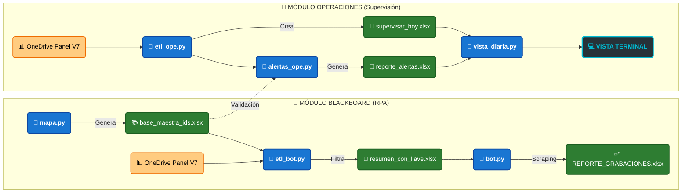

# 🚀 Academic Suite

## 📝 Descripción General
Academic Suite es una potente Aplicación CLI (Command Line Interface) diseñada para centralizar y optimizar las operaciones académicas mediante automatización robótica (RPA) y auditoría de datos.

Este sistema evoluciona de scripts aislados hacia una Arquitectura Modular Desacoplada, permitiendo una gestión independiente entre el scrapping de datos de Blackboard y las tareas de supervisión diaria.

---

## 📂 Arquitectura del Proyecto
El sistema está organizado para garantizar escalabilidad y limpieza de datos:

### 📥 Insumos (`00_inputs/`)
* **`chrome_profile/`**: Almacena sesiones y cookies del navegador para automatizar el acceso y evadir protocolos MFA/SecureAuth.
* **📊 `PANEL DE PROGRAMACIÓN V7.xlsx`**: Fuente de datos primaria sincronizada desde OneDrive para procesamiento local.

### 🧠 Datos Maestros (`01_data/`)
Información estructurada y diccionarios de traducción interna.
* **🔑 `base_maestra_ids.xlsx`**: Diccionario relacional de IDs de cursos extraídos mediante API.
* **⛽ `resumen_con_llave.xlsx`**: datos filtrados y validados que dirigen la ejecución del Robot RPA.

### 📤 Entregables (`02_outputs/`)
* **📁 `bot_blackboard/`**:
    * 📅 **`reporte_grabaciones.xlsx`**: extracción de links de grabación.
* **📁 `operaciones/`**: 
    * ⚠️ **`reporte_alertas.xlsx`**: Detalle de discrepancias y errores críticos detectados en la programación.
    * 📅 **`supervisar_hoy.xlsx`**: Agenda diaria de supervisión con formatos y estilos visuales aplicados.

### 4. 🛠️ Núcleo del Sistema (`src/`)
Dominio de la lógica de negocio, separado en micro-módulos independientes.
* **🤖 `bot_blackboard/`**: 
    * `mapa.py`: mapeo de IDs con la API de Blackboard.
    * `etl_bot.py`: Transformación y limpieza de datos para el consumo del bot.
    * `bot_scrapper.py`: Motor de automatización RPA basado en Playwright.
    * `vista_bot.py`: Interfaz visual en terminal para el seguimiento del bot.
* **📅 `operaciones/`**: 
    * `etl_ope.py`: Procesamiento de la agenda operativa diaria.
    * `alertas_ope.py`: Algoritmos de detección de múltiples docentes o nombres contradictorios.
    * `vista_diaria.py`: Renderizado de reportes y tablas dinámicas con **Rich**.
* **⚙️ `shared/`**: 
    * `excel_utils.py`: Utilidades para manipulación de archivos y sincronización de red.

---

### 🚀 Orquestador Principal: `academic.py`
Punto de entrada único de la aplicación. Utiliza una interfaz de comandos (**CLI**) basada en **Typer** para ejecutar los diferentes módulos del sistema de manera intuitiva y profesional.

---

## 💻 Comandos del Tablero de Control
El sistema se orquesta desde `main.py` con los siguientes comandos:

| Comando | Función | Módulo Interno |
| :--- | :--- | :--- |
| `python main.py bb-etl` | Limpia datos y prepara el combustible para el Bot. | `bot_blackboard/etl_bot.py` |
| `python main.py bb-mapa` | Actualiza IDs internos mediante la API de Blackboard. | `bot_blackboard/mapa.py` |
| `python main.py bb-lanzar` | Inicia el Robot RPA para capturar links de grabación. | `bot_blackboard/bot.py` |
| `python main.py ope-etl` | Genera agenda diaria y audita anomalías del panel. | `operaciones/etl_ope.py` |

---

## 🛠️ Detalle de los Módulos Principales

### 1️⃣ Bloque de Operaciones (Supervisión Inteligente)
Diseñado para eliminar el "ruido visual" y enfocarse en la acción inmediata.
* **Filtro de Tiempo Dinámico:** Ignora automáticamente clases pasadas. Solo muestra desde **HOY** en adelante.
* **Auditoría de Anomalías (`alertas_ope.py`):** Escanea errores de digitación en el panel maestro (múltiples docentes, nombres contradictorios, IDs faltantes en mapa).
* **Vista Diaria (`vista_diaria.py`):** Genera una tabla en terminal con colores:

### 2️⃣ Bloque de Blackboard (RPA Engine)
Utiliza simulación humana para obtener informacion del Blackboard.
* **Técnica del Portapapeles:** Evita leer HTML ofuscado. Realiza clics físicos y captura el link directamente desde el portapapeles del sistema.
* **Imán de Fechas (Regex):** Limpia quirúrgicamente textos complejos como `Friday, Jan 2nd, 20268:53 PM` separándolos en Fecha, Hora Inicio y Fin.
* **Detección "En Vivo":** Identifica si una sesión está siendo grabada en tiempo real para no interrumpir el proceso.

---

## 📊 Diagrama de Flujo

