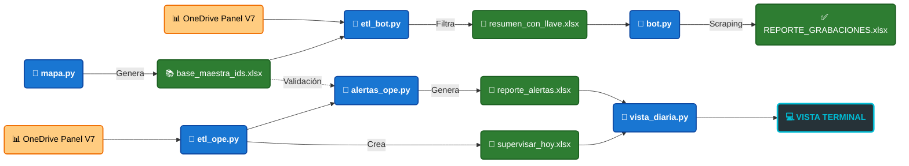
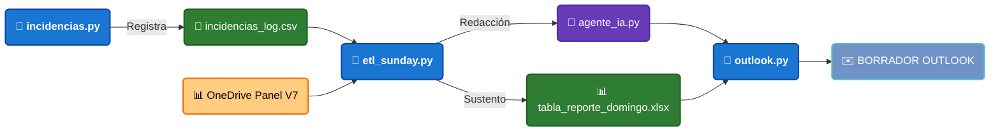

# 🚀 Academic Suite

## 📝 Descripción General
Academic Suite es una potente Aplicación CLI (Command Line Interface) diseñada para centralizar y optimizar las operaciones académicas mediante automatización robótica (RPA), inteligencia artificial y auditoría de datos.

Este sistema evoluciona de scripts aislados hacia una Arquitectura Modular Desacoplada, permitiendo una gestión independiente entre el scrapping de datos de Blackboard, las tareas de supervisión diaria y la comunicación ejecutiva semanal.

---

## 📂 Arquitectura del Proyecto
El sistema está organizado para garantizar escalabilidad, integridad de datos y trazabilidad:

### 📥 Insumos (`00_inputs/`)
* **`chrome_profile/`**: Almacena sesiones y cookies del navegador para automatizar el acceso y evadir protocolos MFA/SecureAuth.
* **📊 `PANEL DE PROGRAMACIÓN V7.xlsx`**: Fuente de datos primaria (Combustible) sincronizada desde OneDrive para procesamiento local.

### 🧠 Datos Maestros (`01_data/`)
Información estructurada, bitácoras históricas y diccionarios de traducción.
* **📁 `bot_blackboard/`**:
    * **📝 `base_maestra_ids.csv`**:
    * **📝 `resumen_con_llave`**:
* **📁 `operaciones/`**:
    * **📊 `reportes_alertas.csv`**:
* **📁 `reporte_semanal/`**:
    * **📝 `incidencias_log.csv`**: registra faltas de docentes
    * **📊 `tabla_reporte_domingo.xlsx`**: Snapshot procesado y ordenado cronológicamente que sirve de sustento para el reporte a coordinación.

### 📤 Entregables (`02_outputs/`)
* **📁 `bot_blackboard/`**:
    * 📅 **`reporte_grabaciones.xlsx`**: Extracción automatizada de links de grabación.
* **📁 `operaciones/`**: 
    * 📅 **`supervisar_hoy.xlsx`**: Agenda diaria de supervisión con formatos y estilos visuales aplicados.

### 4. 🛠️ Núcleo del Sistema (`src/`)
Dominio de la lógica de negocio, separado en micro-módulos independientes.
* **🤖 `bot_blackboard/`**: 
    * `mapa.py`: Mapeo de IDs con la API de Blackboard.
    * `etl_bot.py`: Transformación y limpieza de datos para el consumo del bot.
    * `bot_scrapper.py`: Motor de automatización RPA basado en Playwright.
    * `vista_bot.py`: Interfaz visual en terminal para el seguimiento del bot.
* **📅 `operaciones/`**: 
    * `etl_ope.py`: Procesamiento de la agenda operativa diaria.
    * `alertas_ope.py`: Algoritmos de detección de múltiples docentes o nombres contradictorios.
    * `vista_diaria.py`: Renderizado de reportes y tablas dinámicas con **Rich**.
* **📧 `reporte_semanal/`**:
    * `incidencias.py`: Registro de novedades en la bitácora vinculado a un ID y fecha específica.
    * `etl_sunday.py`: Motor de procesamiento dominical con filtros de semana dinámica y ordenamiento cronológico.
    * `agente_ia.py`: Orquestador de redacción ejecutiva mediante **Groq API (Llama 3.3)**.
    * `outlook.py`: Puente de automatización con **Outlook Classic** para inyección de tablas HTML y firmas.
* **⚙️ `shared/`**: 
    * `excel_utils.py`: Utilidades para manipulación de archivos y sincronización de red.
    * `config.loader.py`: encargado de la gestión de rutas y configuración. Elimina las rutas 'hardcoded'. permite que el comando python academic.py funcione correctamente desde la raíz, orquestando todos los submódulos de manera fluida.
---

### 🚀 Orquestador Principal: `academic.py`
Punto de entrada único de la aplicación. Utiliza una interfaz de comandos (**CLI**) basada en **Typer** para ejecutar los diferentes módulos del sistema de manera intuitiva y profesional.

### `config.yaml`
funciona como el centro de mando del proyecto, centralizando la gestión de rutas (locales y OneDrive), nombres de archivos y parámetros de envío de reportes. Su objetivo principal es desacoplar la configuración de la lógica de Python, permitiendo realizar cambios estructurales

---

## 💻 Comandos del Tablero de Control
El sistema se orquesta desde `academic.py` con los siguientes comandos:

| Comando | Función | Módulo Interno |
| :--- | :--- | :--- |
| `python academic.py bb-mapa` | Ejecutar cuando tenga permisos de supervicion en nuevos programas. Actualiza la Base Maestra de IDs desde la API de Blackboard. | `bot_blackboard/mapa.py` |
| `python academic.py bb-etl` | Prepara (resumen_con_llave) de mis cursos 'activos' para el bot_scrapper en blackboard. | `bot_blackboard/etl_bot.py` |
| `python academic.py bb-scrapper` | Lanza el Robot RPA para extraer link de grabaciones (Chrome). | `bot_blackboard/bot_scrapper.py` |
| `python academic.py ope-etl` | Genera la agenda de supervisión diaria y audita alertas. | `operaciones/etl_ope.py` |
| `python academic.py inc-log` | Anota una incidencia vinculada a un ID y una FECHA específica. | `reporte_semanal/incidencias.py` |
| `python academic.py sunday` | [DOMINGOS] Procesa Panel V7 y redacta el correo con IA. | `reporte_semanal/etl_sunday.py` |
---

## 🛠️ Detalle de los Módulos Principales

### 1️⃣ Bloque de Operaciones (Supervisión Inteligente)
Diseñado para eliminar el "ruido visual" y enfocarse en la acción inmediata.
* **Filtro de Tiempo Dinámico:** Ignora automáticamente clases pasadas. Solo muestra desde **HOY** en adelante.
* **Auditoría de Anomalías:** Escanea errores de digitación en el panel maestro (múltiples docentes, nombres contradictorios, IDs faltantes).

### 2️⃣ Bloque de Blackboard (RPA Engine)
Utiliza simulación humana para obtener información del Blackboard.
* **Técnica del Portapapeles:** Realiza clics físicos y captura el link directamente desde el portapapeles para evadir ofuscación de HTML.
* **Imán de Fechas (Regex):** Limpia quirúrgicamente fechas complejas separándolas en Fecha, Hora Inicio y Fin.

### 3️⃣ Bloque de Reporte Semanal (Executive AI & Mail)
Módulo de comunicación estratégica que integra IA para la rendición de cuentas dominical.
* **Motor de IA (Groq & Llama 3.3):** Utiliza la API de **Groq** para procesar el modelo **Llama 3.3 70B**, logrando una redacción de informes ejecutivos a velocidad luz. Aplica técnicas de *Prompt Engineering* para generar textos breves, profesionales y sin redundancias.
* **Automatización Outlook COM (`pywin32`):** Controla el **Outlook Classic** para inyectar el reporte directamente en una ventana de mensaje. Esto permite capturar la firma institucional configurada por el usuario y sincronizar el borrador automáticamente con **Outlook Modern** y versiones móviles.
* **Inyección de Tablas HTML:** Transforma el contenido del Excel procesado en tablas con estilos CSS (Tabla Azul) incrustadas en el cuerpo del correo, facilitando la lectura del sustento técnico sin necesidad de abrir archivos adjuntos.
* **Integridad Cronológica:** El motor ETL ordena todas las incidencias por fecha real (formato `datetime`), garantizando que la información se presente como una línea de tiempo coherente de la semana.

---

## 📊 Diagrama de Flujo

----------------------------------------------------------
----------------------------------------------------------

