```mermaid
graph LR
    %% --- ESTILOS ---
    classDef script fill:#1976D2,stroke:#0D47A1,stroke-width:2px,color:white,font-weight:bold;
    classDef excel fill:#2E7D32,stroke:#1B5E20,stroke-width:2px,color:white;
    classDef input fill:#FFCC80,stroke:#EF6C00,stroke-width:2px,color:black;
    classDef ai fill:#673AB7,stroke:#512DA8,stroke-width:2px,color:white;
    classDef mail fill:#7192C7,stroke:#5BBEC2,stroke-width:2px,color:white;

    R_ONE(📊 OneDrive Panel V7):::input
    R_INC(🐍 incidencias.py):::script
    R_LOG(📝 incidencias_log.csv):::excel
    R_ETL(🐍 etl_sunday.py):::script
    R_TAB(📊 tabla_reporte_domingo.xlsx):::excel
    R_IA(🧠 agente_ia.py):::ai
    R_OUT(📧 outlook.py):::script
    R_BOR(✉️ BORRADOR OUTLOOK):::mail

    R_INC -->|Registra| R_LOG
    R_LOG --> R_ETL
    R_ONE --> R_ETL
    R_ETL -->|Sustento| R_TAB
    R_ETL -->|Redacción| R_IA
    R_IA --> R_OUT
    R_TAB --> R_OUT
    R_OUT --> R_BOR
```

# 🚀 Academic Suite

## 📝 Descripción General
Academic Suite es una potente Aplicación CLI (Command Line Interface) diseñada para centralizar y optimizar las operaciones académicas mediante automatización robótica (RPA), inteligencia artificial y auditoría de datos.

Este sistema evoluciona de scripts aislados hacia una Arquitectura Modular Desacoplada, permitiendo una gestión independiente entre el scrapping de datos de Blackboard, las tareas de supervisión diaria y la comunicación ejecutiva semanal.

---

## 📂 Arquitectura del Proyecto
El sistema está organizado para garantizar escalabilidad, integridad de datos y trazabilidad:

### 📥 Insumos (`00_inputs/`)
* **`chrome_profile/`**: Almacena sesiones y cookies del navegador para automatizar el acceso y evadir protocolos MFA/SecureAuth.
* **📊 `PANEL DE PROGRAMACIÓN V7.xlsx`**: Fuente de datos primaria (Combustible) sincronizada desde OneDrive para procesamiento local.

### 🧠 Datos Maestros (`01_data/`)
Información estructurada, bitácoras históricas y diccionarios de traducción.
* **🔑 `base_maestra_ids.xlsx`**: Diccionario relacional de IDs de cursos extraídos mediante API.
* **⛽ `resumen_con_llave.xlsx`**: Datos filtrados y validados que dirigen la ejecución del Robot RPA.
* **📁 `reporte_semanal/`**:
    * **📝 `incidencias_log.csv`**: Base de datos de novedades (La fuente de la verdad) que registra fallas reportadas por docentes.
    * **📊 `tabla_reporte_domingo.xlsx`**: Snapshot procesado y ordenado cronológicamente que sirve de sustento para el reporte de jefatura.

### 📤 Entregables (`02_outputs/`)
* **📁 `bot_blackboard/`**:
    * 📅 **`reporte_grabaciones.xlsx`**: Extracción automatizada de links de grabación.
* **📁 `operaciones/`**: 
    * ⚠️ **`reporte_alertas.xlsx`**: Detalle de discrepancias y errores críticos detectados en la programación.
    * 📅 **`supervisar_hoy.xlsx`**: Agenda diaria de supervisión con formatos y estilos visuales aplicados.

### 4. 🛠️ Núcleo del Sistema (`src/`)
Dominio de la lógica de negocio, separado en micro-módulos independientes.
* **🤖 `bot_blackboard/`**: 
    * `mapa.py`: Mapeo de IDs con la API de Blackboard.
    * `etl_bot.py`: Transformación y limpieza de datos para el consumo del bot.
    * `bot_scrapper.py`: Motor de automatización RPA basado en Playwright.
    * `vista_bot.py`: Interfaz visual en terminal para el seguimiento del bot.
* **📅 `operaciones/`**: 
    * `etl_ope.py`: Procesamiento de la agenda operativa diaria.
    * `alertas_ope.py`: Algoritmos de detección de múltiples docentes o nombres contradictorios.
    * `vista_diaria.py`: Renderizado de reportes y tablas dinámicas con **Rich**.
* **📧 `reporte_semanal/`**:
    * `incidencias.py`: Registro de novedades en la bitácora vinculado a un ID y fecha específica.
    * `etl_sunday.py`: Motor de procesamiento dominical con filtros de semana dinámica y ordenamiento cronológico.
    * `agente_ia.py`: Orquestador de redacción ejecutiva mediante **Groq API (Llama 3.3)**.
    * `outlook.py`: Puente de automatización con **Outlook Classic** para inyección de tablas HTML y firmas.
* **⚙️ `shared/`**: 
    * `excel_utils.py`: Utilidades para manipulación de archivos y sincronización de red.
---

### 🚀 Orquestador Principal: `academic.py`
Punto de entrada único de la aplicación. Utiliza una interfaz de comandos (**CLI**) basada en **Typer** para ejecutar los diferentes módulos del sistema de manera intuitiva y profesional.

---

## 💻 Comandos del Tablero de Control
El sistema se orquesta desde `academic.py` con los siguientes comandos:

| Comando | Función | Módulo Interno |
| :--- | :--- | :--- |
| `python academic.py bb-mapa` | Ejecutar cuando tenga permisos de supervicion en nuevos programas. Actualiza la Base Maestra de IDs desde la API de Blackboard. | `bot_blackboard/mapa.py` |
| `python academic.py bb-etl` | Prepara (resumen_con_llave) de mis cursos 'activos' para el bot_scrapper en blackboard. | `bot_blackboard/etl_bot.py` |
| `python academic.py bb-scrapper` | Lanza el Robot RPA para extraer link de grabaciones (Chrome). | `bot_blackboard/bot_scrapper.py` |
| `python academic.py ope-etl` | Genera la agenda de supervisión diaria y audita alertas. | `operaciones/etl_ope.py` |
| `python academic.py inc-log` | Anota una incidencia vinculada a un ID y una FECHA específica. | `reporte_semanal/incidencias.py` |
| `python academic.py sunday` | [DOMINGOS] Procesa Panel V7 y redacta el correo con IA. | `reporte_semanal/etl_sunday.py` |
---

## 🛠️ Detalle de los Módulos Principales

### 1️⃣ Bloque de Operaciones (Supervisión Inteligente)
Diseñado para eliminar el "ruido visual" y enfocarse en la acción inmediata.
* **Filtro de Tiempo Dinámico:** Ignora automáticamente clases pasadas. Solo muestra desde **HOY** en adelante.
* **Auditoría de Anomalías:** Escanea errores de digitación en el panel maestro (múltiples docentes, nombres contradictorios, IDs faltantes).

### 2️⃣ Bloque de Blackboard (RPA Engine)
Utiliza simulación humana para obtener información del Blackboard.
* **Técnica del Portapapeles:** Realiza clics físicos y captura el link directamente desde el portapapeles para evadir ofuscación de HTML.
* **Imán de Fechas (Regex):** Limpia quirúrgicamente fechas complejas separándolas en Fecha, Hora Inicio y Fin.

### 3️⃣ Bloque de Reporte Semanal (Executive AI & Mail)
Módulo de comunicación estratégica que integra IA para la rendición de cuentas dominical.
* **Motor de IA (Groq & Llama 3.3):** Utiliza la API de **Groq** para procesar el modelo **Llama 3.3 70B**, logrando una redacción de informes ejecutivos a velocidad luz. Aplica técnicas de *Prompt Engineering* para generar textos breves, profesionales y sin redundancias.
* **Automatización Outlook COM (`pywin32`):** Controla el **Outlook Classic** para inyectar el reporte directamente en una ventana de mensaje. Esto permite capturar la firma institucional configurada por el usuario y sincronizar el borrador automáticamente con **Outlook Modern** y versiones móviles.
* **Inyección de Tablas HTML:** Transforma el contenido del Excel procesado en tablas con estilos CSS (Tabla Azul) incrustadas en el cuerpo del correo, facilitando la lectura del sustento técnico sin necesidad de abrir archivos adjuntos.
* **Integridad Cronológica:** El motor ETL ordena todas las incidencias por fecha real (formato `datetime`), garantizando que la información se presente como una línea de tiempo coherente de la semana.

---

## 📊 Diagrama de Flujo

```mermaid
graph LR
    %% --- ESTILOS ---
    classDef script fill:#1976D2,stroke:#0D47A1,stroke-width:2px,color:white,font-weight:bold;
    classDef excel fill:#2E7D32,stroke:#1B5E20,stroke-width:2px,color:white;
    classDef terminal fill:#263238,stroke:#00BCD4,stroke-width:3px,color:#00BCD4,font-weight:bold;
    classDef input fill:#FFCC80,stroke:#EF6C00,stroke-width:2px,color:black;

    %% --- MÓDULO BLACKBOARD (RPA) ---
    M_MAPA(🐍 mapa.py):::script
    M_BASE(📚 base_maestra_ids.xlsx):::excel
    M_ONE(📊 OneDrive Panel V7):::input
    M_ETL(🐍 etl_bot.py):::script
    M_RES(🔑 resumen_con_llave.xlsx):::excel
    M_BOT(🤖 bot.py):::script
    M_FIN(✅ REPORTE_GRABACIONES.xlsx):::excel

    M_MAPA -->|Genera| M_BASE
    M_BASE --> M_ETL
    M_ONE --> M_ETL
    M_ETL -->|Filtra| M_RES
    M_RES --> M_BOT
    M_BOT -->|Scraping| M_FIN

    %% --- MÓDULO OPERACIONES (Supervisión) ---
    O_ONE(📊 OneDrive Panel V7):::input
    O_ETL(🐍 etl_ope.py):::script
    O_AGE(📅 supervisar_hoy.xlsx):::excel
    O_ALE(🐍 alertas_ope.py):::script
    O_REP(🚨 reporte_alertas.xlsx):::excel
    O_VIS(🐍 vista_diaria.py):::script
    O_TER(💻 VISTA TERMINAL):::terminal

    O_ONE --> O_ETL
    O_ETL -->|Crea| O_AGE
    O_ETL --> O_ALE
    O_ALE -->|Genera| O_REP
    
    O_AGE --> O_VIS
    O_REP --> O_VIS
    O_VIS --> O_TER

    %% Relación entre módulos
    M_BASE -.->|Validación| O_ALE
```

----------------------------------------------------------
----------------------------------------------------------

